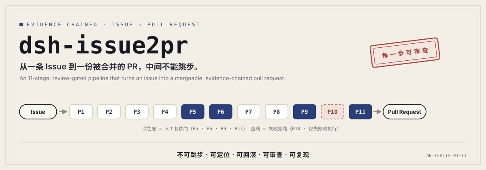
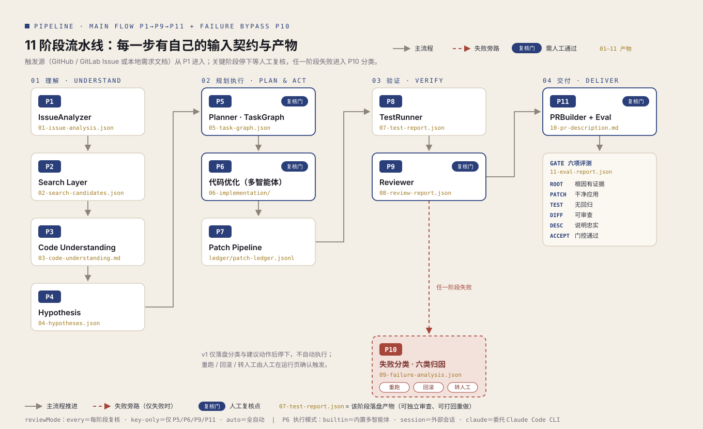

<div align="center">
  
  <p>
    <a href="LICENSE"></a>
    <a href="https://www.npmjs.com/package/dsh-issue2pr"></a>
    
    
    
    
    <a href="#-贡献"></a>
  </p>
</div>

> **从一条 Issue 到一份被合并的 PR，中间不能跳步。**
> 每一段路径都有自己的输入契约、失败信号、可回滚产物与可独立审查的 Artifact。

**dsh-issue2pr** 是一个运行在 [DSH 宿主](#-快速开始)里的全局插件：把一条 GitHub / GitLab Issue（或本地需求文档）交给一条 **11 阶段流水线**，经过检索、理解、诊断、规划、多智能体编码、真实测试、三维审查与 Gate 评测，最终产出一份**忠实反映修改与验证过程**的 PR 说明——以及一整条可供打回、重跑、回滚与追溯的证据链。

它不是又一个「一把梭」的 coding agent。在这里，**真正的交付物不是 PR 文本，而是一份可审查的系统**：每一段产出都有编号产物落盘，每一次状态变更都有 Trace，每一个关键节点都有人工复核门。

---

## ✨ 特性总览

- 🔗 **11 阶段全链路**：Issue 分析 → 检索 → 代码理解 → 根因假设 → 任务规划 → 编码 → 补丁管线 → 测试 → 审查 → PR 构建，一步不省。
- 🚦 **人工复核门**：P5 / P6 / P9 / P11 四道关键门控，`approve` 放行、`reject` 带意见打回重跑；复核模式可选每阶段 / 仅关键 / 全自动。
- 🧾 **产物证据链**：每个阶段落盘一份编号产物（`01-*.json` … `10-pr-description.md`），输入来自上游产物、输出去往下游契约，可独立审查、可打回重做。
- 🔁 **可回滚**：Patch Pipeline 带台账（ledger），只撤销 Agent 引入的修改，不碰用户自己的代码。
- 🧪 **真实测试**：结果必须来自真实工具执行——在克隆的仓库里跑真实测试命令，完整输出落盘可回溯。
- 🤝 **多智能体 + 外部委托**：P6 内置 Planner / Coder / Reviewer 多智能体协同；也可把阶段产出任务包，委托 DSH 会话或 Claude Code CLI 无人值守执行。
- 🖥️ **工作台 UI**：项目 / 运行 / 产物 / 配置 / 说明五个页面 + 右上角悬浮智能助手（实时上下文问答、流式输出、可拖拽缩放）。
- 🔌 **Git 托管连接**：GitHub / GitLab / 华为云 CodeArts 凭据全局共享，私有仓库克隆与 Issue 抓取自动注入；带探活与仓库连通性测试。
- 🧭 **逐阶段配置**：每个阶段可单独改提示词、换模型、调节流超时、调专属参数——改完下一阶段即生效。
- 📡 **全程可观测**：`trace/events.jsonl` 记录每次 LLM 调用、git 操作、测试执行的开始 / 完成 / 失败，阶段详情实时展示。

## 🧭 工作原理

<div align="center">
  
</div>

一次 **Run** 就是一条证据链：发起时从触发源读入 Issue 原文，主流程 `P1→P9→P11` 依次推进，每步落盘产物；任何阶段失败立即停下并进入 P10 分类旁路；到达复核门时等待人工 `approve / reject`，打回的意见会传回该阶段重新执行。

### 阶段一览

| 阶段 | 名称 | 职责 | 落盘产物 | 复核门 |
| --- | --- | --- | --- | --- |
| **P1** | IssueAnalyzer | 把自然语言 Issue 提炼为结构化契约：现象 / 触发条件 / 影响范围 / 可验证成功标准 / 风险等级 | `01-issue-analysis.json` | |
| **P2** | Search Layer | 按仓库文件清单选候选文件，每条附选择理由与置信度 | `02-search-candidates.json` | |
| **P3** | Code Understanding | 深读候选源码，输出关键函数、完整调用链与潜在修改点（带 `路径:行号` 锚点） | `03-code-understanding.md` | |
| **P4** | Hypothesis | 可验证根因假设：每条必须带证据、验证文件与验证方法 | `04-hypotheses.json` | |
| **P5** | Planner | 拆解为有依赖关系的 TaskGraph，每节点可独立验证，并指定复核门与 PR 门 | `05-task-graph.json` | ✅ |
| **P6** | 代码优化 | 内置多智能体（Planner 派单 → 并行 Coder → Reviewer 门控）；可委托外部会话或 Claude Code CLI | `06-implementation/patches/*.diff` | ✅ |
| **P7** | Patch Pipeline | diff 版本校验 → 落盘，写 patch 台账（回滚依据） | `ledger/patch-ledger.jsonl` | |
| **P8** | TestRunner | 在真实仓库执行测试命令，完整输出落盘（成功与失败路径均保留） | `07-test-report.json` | |
| **P9** | Reviewer | 三维门控审查：① Diff 范围 ② API 与安全 ③ 测试补强与说明忠实——测试通过 ≠ 可合并 | `08-review-report.json` | ✅ |
| **P10** | FailureClassifier | 失败旁路：六类归因（实现错误 / 根因错误 / 测试选择 / 环境缺失 / 权限被拒 / 反复失败）→ 重跑 / 回滚 / 转人工 | `09-failure-analysis.json` | 仅失败时 |
| **P11** | PRBuilder + Eval | 生成忠实 PR 说明（背景 / 根因 / 修改点 / 验证证据 / 风险）+ Gate 六项评测 | `10-pr-description.md` · `11-eval-report.json` | ✅ |

### 五条不变命题

> 从 Issue 到 PR 这条链上，无论 Agent 如何演进，这 5 条不能变。

| 命题 | 含义 |
| --- | --- |
| **不可跳步** | 分析、检索、理解、规划、修改、测试、Review、评测，一步都不能省——省了任何一步，PR 都不能称为「交付」。 |
| **可定位** | 任何失败都必须能落到具体模块；没有归属的失败，不允许简单重跑。 |
| **可回滚** | Agent 引入的修改必须可逆，且能区分「用户改的」与「Agent 改的」。 |
| **可审查** | 交付物是一份 Patch、一组测试日志、一份 PR 说明与一份评测报告——每一份都要能被打回重做。 |
| **可复现** | 全链路 Trace 从 Issue 贯穿到 PR；没有 Trace，PR 是怎么生成的永远无法解释。 |

### 两种关键模式

**复核模式 `reviewMode`** —— 决定哪些阶段要停下来等人：

| 取值 | 行为 |
| --- | --- |
| `every` | 每个阶段完成后都进入复核门 |
| `key-only` | 仅 P5 / P6 / P9 / P11 四道关键门停（推荐） |
| `auto` | 全自动推进，不停留 |

**P6 执行模式 `p6Mode`** —— 决定代码由谁写：

| 取值 | 行为 |
| --- | --- |
| `builtin` | 内置多智能体：Planner 派单 → 并行 Coder（TDD / 最小 diff 纪律）→ Reviewer 门控 |
| `session` | 生成任务包交给 DSH 会话执行，人工完成后通过复核门放行 |
| `claude` | 任务包自动委托 Claude Code CLI 无人值守执行（`--add-dir` 写产物目录，停止/删除时杀进程树），失败回退等人工会话 |

### 委外智能体：多方式发现 + 测试门禁

选 `claude` 模式后，项目页与配置页出现「委外智能体」绑定卡：

- **多方式发现**：自动扫描五种来源并去重合并——项目配置 > 环境变量 `ISSUE2PR_CLAUDE_BIN` > 常见安装位置 > `npm config get prefix` 全局目录 > PATH 查找；也可手动指定完整路径（留空 = 自动探测）。
- **测试门禁**：点「测试门禁」真实跑一次极小调用，三步全绿（定位 → `--version` → 认证微任务）才能保存——`403 IP access denied by API-Key restrictions`、未登录这类认证错误在**绑定时**就拦截并给出处置提示（IP 白名单 / 登录 / 代理出口），而不是等 Run 走到 P6 才失败回退。微任务仅一轮、几十 token，费用可忽略。
- 改过绑定路径后门禁结果即失效，需重测；服务端保存时另有 `--version` 级快检兜底（拦路径写错 / 未安装）。

## 🚀 快速开始

### 环境要求

- **DSH 宿主**（插件随 dsh web 同生共死）
- **Node.js ≥ 18**、**git**（克隆仓库 / 版本校验）
- 可选：**Claude Code CLI**（仅 `p6Mode: "claude"` 需要，可在配置页指定路径）
- LLM：优先使用 DSH 宿主当前选中的默认模型，也可逐阶段覆盖

### 安装

已发布到 npm（推荐——预构建包，无需授权构建脚本）：

```bash
dsh plugin --profile web add dsh-issue2pr
```

或从源码安装——把本插件克隆进 DSH 插件目录，然后重启 DSH：

```bash
# Windows: C:\Users\<you>\.dsh\plugins\
# macOS / Linux: ~/.dsh/plugins/
cd ~/.dsh/plugins
git clone https://github.com/LONGSASASASASA/dsh-issue2pr.git dsh-issue2pr
```

> 也可以通过 [dsh-plugin-manager](https://github.com/LONGSASASASASA) 插件安装与管理；审阅源码后可用 `dsh plugin --profile web add github:LONGSASASASASA/dsh-issue2pr#<commit>` 锁定 commit 安装。数据默认存放在 `~/.dsh/issue2pr/`（与插件目录分离，升级插件不丢数据）。

### 五分钟跑通第一单

1. **建项目**：打开 DSH → 侧边栏「Issue2PR」→ 项目页 → 新建。填名称、slug、仓库地址；触发源可以是 GitHub / GitLab Issue 链接，也可以是本地需求文档路径。
2. **配连接**（私有仓库需要）：在项目页「Git 托管连接」添加 GitHub / GitLab / CodeArts 凭据，点「测试」探活；公开仓库与 `GITHUB_TOKEN` 环境变量也能直接用。
3. **发起 Run**：粘贴 Issue 链接或选择本地需求文档，点发起。插件自动浅克隆主仓库并开始推进。
4. **盯运行、过复核门**：运行页看阶段进度与事件流；到复核门时查看该阶段产物，`approve` 放行或 `reject` 带意见打回。
5. **拿 PR 说明**：P11 通过后，产物页打开 `10-pr-description.md`——背景、根因、修改点、验证证据、风险一应俱全，据此开 PR；`11-eval-report.json` 是 Gate 六项自评。

> 环境不对劲？项目页会显示 **preflight 健康探测**：git 版本、claude CLI 是否就绪、当前默认模型从哪来（阶段覆盖 / 宿主默认 / 插件兜底）。

## ⚙️ 配置详解

### 项目配置（project.json）

项目页保存的就是下面这份配置，所有字段均有校验：

```jsonc
{
  "name": "我的项目",
  "slug": "my-project",                  // 小写字母/数字/连字符
  "repos": ["https://github.com/me/my-project.git"],
  "triggers": [
    { "kind": "issue", "uri": "https://github.com/me/my-project/issues/42" },
    { "kind": "requirement", "uri": "C:/docs/需求-登录修复.md" }
  ],
  "reviewMode": "key-only",              // every | key-only | auto
  "p6Mode": "builtin",                   // builtin | session | claude
  "testCommand": "npm test",             // 留空则自动探测 package.json 的 test 脚本
  "stageConfig": { /* 逐阶段覆盖，见下 */ }
}
```

### 逐阶段配置（stageConfig）

每个阶段都可独立覆盖，未配置项回落默认值，**改动在下一阶段即时生效**：

```jsonc
"stageConfig": {
  "P3": {
    "provider": "deepseek-official",     // 本阶段换模型
    "model": "deepseek-v4-pro",
    "reasoningEffort": "high",
    "timeoutMs": 600000,
    "maxTokens": 16384,
    "prompts": { "": "你是 Code Understanding……（覆盖默认提示词）" },
    "params": { "deepReadFiles": 10, "fileChars": 8000 }
  },
  "P6": {
    "delegate": { "mode": "session" },   // 本阶段委托外部智能体，产出就绪才放行
    "params": {
      "claudeBin": "C:\\Users\\you\\AppData\\Roaming\\npm\\claude.cmd",
      "claudeTimeoutMin": 120
    }
  },
  "P9": { "params": { "diffChars": 2000 } }
}
```

阶段专属参数（如 `repoScanMax`、`deepReadFiles`、`diffChars`、`claudeBin`）在「配置」页有中文说明与默认值——**凡影响执行行为的数值与路径都不硬编码**，全部可被项目配置覆盖。

### Git 托管连接

| 类型 | 凭据 | 说明 |
| --- | --- | --- |
| GitHub | Access Token | 克隆注入 `x-access-token`；Issue 抓取与 API 探活走 `/user` |
| GitLab | Personal Access Token | 支持自建实例（自定义 host）；注入 `oauth2` |
| 华为云 CodeArts | HTTPS 密码 + 用户名 | 凭 `git ls-remote` 真实仓库测试连通 |

- 全局共享一份（`~/.dsh/issue2pr/connections.json`），多项目复用；ssh 形态地址走本机密钥，不注入。
- 凭据**只存本机**，返回给 UI 一律脱敏（`gh05…x8k2`），事件日志中的 URL 自动抹除凭据段。
- Run 进行中新增 / 修改连接，下一阶段即生效。

## 📦 数据与产物布局

所有数据集中在 `~/.dsh/issue2pr/`，一次 Run 一个目录 = 一条完整证据链：

```text
~/.dsh/issue2pr/
├─ connections.json                  # Git 托管连接凭据（全局共享，本机明文）
├─ ui-state.json                     # UI 选中记忆兜底（宿主重启不丢）
└─ projects/
   └─ <slug>/
      ├─ project.json                # 项目配置（含 stageConfig）
      ├─ repo/                       # git clone --depth 1 的主仓库
      └─ runs/<时间戳-slug>/         # 一次 Run 一个目录
         ├─ run.json                 # 状态机唯一事实源（每步落盘）
         ├─ 01-issue-analysis.json   # P1 … P11 的编号产物
         ├─ 02-search-candidates.json
         ├─ 03-code-understanding.md
         ├─ 04-hypotheses.json
         ├─ 05-task-graph.json
         ├─ 06-implementation/       # patches/*.diff + coder-report.json
         ├─ ledger/patch-ledger.jsonl  # P7 台账：rollback 的依据
         ├─ 07-test-report.json      # + 08-test-output.txt（完整测试输出）
         ├─ 08-review-report.json
         ├─ 09-failure-analysis.json # 仅失败路径
         ├─ 10-pr-description.md     # + 11-eval-report.json（Gate 六项）
         ├─ reviews/*.json           # 每一次复核决定（approve/reject + 意见）
         └─ trace/                   # events.jsonl + spans.jsonl 全程可观测
```

## 🖥️ 界面一览

| 页面 | 你在这里做什么 |
| --- | --- |
| **项目** | 新建 / 编辑项目，配置仓库、触发源、复核模式，管理 Git 托管连接，发起 Run |
| **运行** | 阶段进度总览、逐阶段事件流（LLM 调用 / git / 测试）、复核门审批、停止 / 回退重跑 / 回滚 / 删除 |
| **产物** | 按 Run 浏览产物树，逐文件查看（200KB 内直接预览） |
| **配置** | 逐阶段编辑提示词、模型路由、超时、专属参数与委托开关 |
| **说明** | 内置使用说明与阶段速查 |

右上角还有一颗**悬浮智能助手**：它读取你当前所在的页面 / 项目 / Run 作为实时上下文，流式回答「跑到哪了、为什么失败、复核门是什么」这类问题，面板可拖动、可拉伸、跨重启记忆尺寸与位置。

## 🔌 REST API 一览

插件随宿主注册在 `/issue2pr` 前缀下，UI 之外也可脚本调用：

| 方法 | 路径 | 用途 |
| --- | --- | --- |
| GET | `/issue2pr/api/ping` | 健康检查 |
| GET | `/issue2pr/api/stage-defaults` | 阶段能力表与默认提示词 |
| GET/POST | `/issue2pr/api/ui-state` | UI 偏好兜底存储 |
| GET/POST/DELETE | `/issue2pr/api/connections[/:id]` | Git 托管连接管理 |
| POST | `/issue2pr/api/connections/test` | 凭据探活 |
| POST | `/issue2pr/api/connections/test-repo` | 真实仓库连通性（`git ls-remote`） |
| GET | `/issue2pr/api/preflight` | 环境健康探测（git / claude CLI / LLM 路由来源） |
| GET | `/issue2pr/api/agents/discover?slug=` | 委外智能体多方式发现（配置/env/常见位置/npm 前缀/PATH） |
| POST | `/issue2pr/api/agents/test` | 委外智能体测试门禁（定位 → 版本 → 认证微任务） |
| POST | `/issue2pr/api/check-local` | 本地触发源存在性 |
| POST | `/issue2pr/api/assistant/ask` | 悬浮助手问答（NDJSON 流式） |
| GET/POST | `/issue2pr/api/projects` | 项目列表 / 保存 |
| DELETE | `/issue2pr/api/projects/:slug?confirm=slug` | 删除项目（防误删确认） |
| GET/POST | `/issue2pr/api/projects/:slug/runs` | Run 列表 / 发起（同秒重复返回 409） |
| GET | `.../runs/:runId` | Run 详情（含外部执行进度） |
| POST | `.../runs/:runId/stop` · `rerun` · `review` · `rollback` · `open` | 停止 / 回退重跑 / 复核 / 回滚 / 打开产物目录 |
| DELETE | `.../runs/:runId` | 删除 Run |
| GET | `.../runs/:runId/tree` · `artifact?path=` | 产物树 / 读取单个产物 |

## 🧪 开发与测试

```bash
npm install
npm test        # node --test，覆盖 API / 流水线 / 各阶段执行器 / 连接 / 存储
```

| 模块 | 职责 |
| --- | --- |
| `index.js` | REST API + 驱动循环（node 半，随宿主同生共死） |
| `client.js` | 工作台 UI（web 半） |
| `lib/pipeline.js` | 状态机核心：`advance` 推进、`applyReview` 复核 |
| `lib/stageConfig.js` | 阶段能力表、配置合并、委托任务包 |
| `lib/stages/p1…p11` | 11 个阶段执行器（输入契约 → 产物落盘） |
| `lib/llm.js` | LLM 路由解析 + JSON 契约解析（失败重试一次） |
| `lib/connections.js` | 托管连接、凭据注入与脱敏 |
| `lib/agents.js` | 委外智能体发现与测试门禁 |
| `lib/store.js` | 目录规则与产物读写（唯一允许写盘的地方） |
| `lib/assistant.js` | 智能助手上下文聚合 |
| `tests/` | 单测 + `e2e-live.mjs` 真实链路演练 |

设计背后的完整调研（端到端架构、Sub-Agent 取舍、缓存与记忆边界、评测指标）见 [issue2pr-research.html](./issue2pr-research.html)。

## 📌 当前边界

诚实清单——用之前先知道这些：

- 主仓库以 `--depth 1` 浅克隆，且当前按**单主仓库**工作（`repos[0]`）。
- P10 只做失败分类与建议动作，**不自动 replan**；重跑 / 回滚由人工在运行页确认触发。
- 测试命令自动探测目前只认 `package.json` 的 `test` 脚本，其他语言请显式配置 `testCommand`。
- 托管凭据明文存于本机 `connections.json`（与本机 `GITHUB_TOKEN` 环境变量同级安全），请勿把数据目录提交进任何仓库。
- 产物在线预览上限 200KB，更大的文件请在产物目录直接打开。
- `claude` 委托模式在宿主进程内无人值守执行，请先评估 `--dangerously-skip-permissions` 的适用性。

## 🤝 贡献

欢迎 Issue 与 PR！约定：

- 遵循「外科手术式改动」：只动必须动的地方，不顺手重构。
- 行为变更请先补测试（`node --test`），再动实现。
- 阶段执行器保持「输入契约 → 产物落盘」形态，不要在阶段内私设全局状态。
- 提交信息用中文，格式参照既有历史（`feat: / fix: / chore: …`）。

## 📄 许可证

[MIT](LICENSE) © LONGSASASASASA
